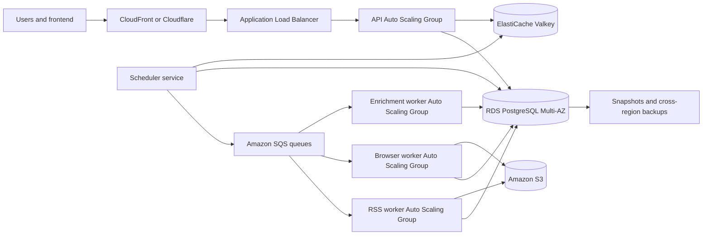

# GeoAtlas Large-Scale Hosting and Cost Guide

Last updated: June 20, 2026

## Executive recommendation

Use **Amazon Web Services in the Mumbai region (`ap-south-1`)** as the primary
production platform.

The recommended deployment is:

- EC2 Auto Scaling Groups for the FastAPI API and ingestion workers.
- Dedicated x86 worker instances for Playwright/Chromium scraping.
- Amazon RDS for PostgreSQL with Multi-AZ and PostGIS.
- Amazon ElastiCache for Valkey/Redis-compatible coordination and caching.
- Amazon SQS for durable ingestion queues.
- Amazon S3 for raw payload archives, exports, images, and backups.
- Application Load Balancer for API traffic.
- CloudFront or Cloudflare for CDN, DDoS protection, and web application
  firewall functionality.
- CloudWatch, OpenTelemetry, and an error tracker for monitoring.

This is the best overall option for GeoAtlas because it combines:

- strong India-region availability;
- mature managed PostgreSQL, queues, object storage, load balancing, and
  autoscaling;
- predictable x86 compute for browser workers;
- a straightforward path from one region to multi-region disaster recovery;
- the ability to use Spot capacity for fault-tolerant ingestion work;
- enough service depth to support future search, analytics, AI, and streaming
  pipelines.

Do **not** begin with Kubernetes merely because the product is expected to
become large. EC2 Auto Scaling Groups managed through immutable machine images
and `systemd` provide the required scale with less operational overhead and
preserve GeoAtlas's current non-Docker deployment boundary. Consider EKS only
after the organization has a platform team and enough independently deployed
services to justify Kubernetes.

## Important limitation in the current backend

The current code can run continuously on a production VM, but its scheduler and
worker launcher still live inside the FastAPI application process. PostgreSQL
advisory locking prevents duplicate scheduler selection, and ingestion jobs are
isolated into subprocesses, but this is not the final architecture for a
large-scale deployment.

Before horizontal production scaling, split the system into:

1. `geoatlas-api` — stateless public/admin FastAPI service.
2. `geoatlas-scheduler` — creates due jobs and places them on a durable queue.
3. `geoatlas-rss-worker` — high-concurrency, network-oriented RSS processing.
4. `geoatlas-browser-worker` — lower-concurrency Playwright/Chromium scraping.
5. `geoatlas-enrichment-worker` — location, categorization, and later AI work.

Use SQS or Redis Streams for the durable queue. Do not rely on in-memory thread
sets or local subprocess ownership once more than one machine is involved.

## Recommended production architecture

## Recommended specifications

### Initial large-scale production foundation

This is the smallest configuration recommended for a revenue-generating,
business-critical launch. It is intentionally larger than a prototype server
and leaves room for upgrades.

| Component | Recommended starting specification |
| --- | --- |
| API | 2 × EC2 instances, each 4 vCPU and 16 GiB RAM |
| Scheduler | 2 × small instances, each 2 vCPU and 4 GiB RAM; one active through leader locking |
| RSS workers | 2 × instances, each 8 vCPU and 16–32 GiB RAM |
| Browser workers | 2 × x86 instances, each 8 vCPU and 32 GiB RAM |
| PostgreSQL | 4 vCPU, 16 GiB RAM, Multi-AZ, 200–500 GiB gp3 storage |
| Cache/queue coordination | 2-node Valkey/Redis-compatible deployment, 2–6 GiB usable memory |
| Durable queue | SQS Standard queues with dead-letter queues |
| Object storage | 500 GiB–2 TiB S3 initially, with lifecycle policies |
| Load balancer | 1 Application Load Balancer across at least two Availability Zones |
| CDN/WAF | CloudFront + AWS WAF, or Cloudflare Business |
| Backups | Daily snapshots, point-in-time recovery, cross-region copy |

Suggested EC2 families:

- API: `m7i-flex.xlarge` or `m7i.xlarge`.
- RSS workers: `m7i.xlarge` to `m7i.2xlarge`.
- Browser workers: `m7i.2xlarge`; use x86 because it is the least-friction
  Playwright/Chromium target.
- Scheduler: `t3.medium` or a comparable general-purpose instance.

Run API and worker fleets in separate Auto Scaling Groups. Browser workloads
must never be allowed to exhaust memory needed by the public API.

### Growth configuration

Use this when GeoAtlas reaches roughly 10,000–50,000 active sources, millions
of daily API requests, or sustained browser scraping.

| Component | Growth specification |
| --- | --- |
| API | 4–10 instances, each 4 vCPU and 16 GiB RAM |
| RSS workers | 4–20 instances, 8 vCPU and 16–32 GiB RAM |
| Browser workers | 4–20 instances, 8–16 vCPU and 32–64 GiB RAM |
| PostgreSQL | 8–16 vCPU, 32–64 GiB RAM, Multi-AZ, one or more read replicas |
| Cache | 6–25 GiB replicated or clustered Valkey |
| Search | Add OpenSearch only when PostgreSQL full-text/geospatial queries no longer meet latency targets |
| Storage | 2–20 TiB S3 with Standard, Intelligent-Tiering, and Glacier lifecycle tiers |

Autoscale workers using queue depth, oldest-message age, average job duration,
failure rate, CPU, and memory. Do not autoscale only from CPU.

### Enterprise/hyperscale configuration

For 50,000+ active sources, high global traffic, or contractual availability:

- multiple worker pools by geography and connector type;
- Aurora PostgreSQL or large RDS PostgreSQL with read replicas;
- Redis/Valkey cluster mode;
- OpenSearch for large news discovery and aggregation workloads;
- active/passive disaster recovery in a second AWS region;
- S3 cross-region replication;
- globally distributed CDN and WAF;
- separate analytics warehouse or lakehouse;
- dedicated observability and security accounts;
- Savings Plans for baseline API capacity and Spot instances for retryable
  workers.

## Estimated AWS monthly cost

These are planning ranges, not quotations. They are based on public
pay-as-you-go pricing available on June 20, 2026. Actual Mumbai-region pricing,
tax, support plans, outbound bandwidth, request volume, backups, and negotiated
discounts will change the total.

| Deployment stage | Expected monthly infrastructure cost |
| --- | ---: |
| Development/staging | **$250–$700** |
| Lean single-region production, limited HA | **$700–$1,500** |
| Recommended HA production foundation | **$2,000–$4,000** |
| Growth deployment | **$6,000–$15,000** |
| Enterprise/multi-region | **$20,000–$60,000+** |

### Recommended HA foundation cost model

| Cost area | Expected monthly range |
| --- | ---: |
| API and scheduler EC2 | $350–$700 |
| RSS and browser worker EC2 | $700–$1,400 |
| Multi-AZ PostgreSQL and storage | $600–$1,100 |
| Valkey/Redis-compatible cache | $120–$350 |
| Load balancer, NAT, DNS, certificates | $100–$300 |
| S3, backups, logs, monitoring | $75–$300 |
| CDN/WAF | $20–$300 before heavy bandwidth |
| **Estimated total** | **$1,965–$4,450** |

The largest unpredictable expenses will be:

1. internet egress and CDN traffic;
2. browser-worker hours;
3. database size, IOPS, and replicas;
4. log ingestion and retention;
5. OpenSearch, if introduced;
6. premium cloud support.

AWS Reserved Instances can reduce eligible EC2 pricing by up to 72%, Compute
Savings Plans cover EC2 and Fargate commitments, and Spot instances can offer
up to 90% discounts. Only place retryable worker capacity on Spot; keep API,
scheduler baseline, database, and critical cache capacity on stable instances.

## Platform comparison

### 1. AWS — best overall recommendation

**Recommended for:** the primary production platform and long-term global
product.

**Advantages**

- Best service coverage for the complete architecture.
- Strong Mumbai region and global expansion path.
- Excellent autoscaling, queueing, database, storage, security, and monitoring.
- EC2 is well suited to persistent browser processes.
- SQS separates ingestion durability from API process lifetime.
- Spot capacity can materially reduce worker cost.

**Disadvantages**

- Highest operational and billing complexity.
- NAT gateways, logging, and data transfer can create surprise costs.
- Requires infrastructure-as-code and disciplined account/network design.

**Expected cost:** $2,000–$4,000/month for the recommended HA foundation;
$6,000–$15,000/month at meaningful growth.

### 2. Google Cloud — strongest alternative

Recommended architecture:

- Cloud Run for the stateless API.
- Compute Engine Managed Instance Groups for persistent browser workers.
- Cloud Scheduler and Pub/Sub for job dispatch.
- Cloud SQL PostgreSQL with HA.
- Memorystore for Redis.
- Cloud Storage and Cloud CDN.

Cloud Run can be extremely economical for bursty API traffic. Google publishes
an example of a 10-million-request API costing $13.69/month under its example
traffic assumptions, but always-on or CPU-heavy services cost more. A
continuously running 1-vCPU/512-MiB worker-pool example is $11.61/month before
free-tier adjustments. These examples do not include the database, browser
workers, networking, or storage.

**Advantages**

- Excellent serverless API experience.
- Strong data, analytics, and AI ecosystem.
- Clear path to Pub/Sub, BigQuery, and Vertex AI.
- GKE has a flat $0.10/hour cluster management fee, with credits available for
  eligible clusters.

**Disadvantages**

- Cloud Run is not the ideal home for long-lived, unpredictable browser
  processes; use Compute Engine workers.
- Cloud SQL and cross-service egress can become expensive.
- Fewer team members may have operational familiarity compared with AWS.

**Expected comparable cost:** $1,800–$4,000/month for HA production;
$5,000–$14,000/month at growth.

### 3. Microsoft Azure — best when the organization is Microsoft-centered

Recommended architecture:

- Virtual Machine Scale Sets for browser workers.
- Azure Container Apps or Linux App Service for API services.
- Azure Service Bus for durable jobs.
- Azure Database for PostgreSQL Flexible Server with zone-redundant HA.
- Azure Managed Redis.
- Blob Storage, Front Door, and Azure Monitor.

Azure Container Apps includes monthly free allocations of 180,000 vCPU-seconds,
360,000 GiB-seconds, and two million requests. Azure PostgreSQL bills compute,
storage, and backups separately; zone-redundant HA charges for both primary and
secondary resources.

**Advantages**

- Strong enterprise identity, governance, and hybrid-cloud integration.
- Good choice for Microsoft-heavy customers and procurement.
- Mature global network and managed database offerings.

**Disadvantages**

- Pricing is often difficult to estimate without the calculator.
- Linux/browser-worker operations are less simple than an EC2-first AWS model.
- Some services overlap, making architecture selection confusing.

**Expected comparable cost:** $2,000–$4,500/month for HA production;
$6,000–$16,000/month at growth.

### 4. DigitalOcean — best price/simplicity balance

Recommended architecture:

- Droplets or DigitalOcean Kubernetes for API and workers.
- Managed PostgreSQL.
- Managed Valkey.
- Spaces object storage and a managed load balancer.

Published managed PostgreSQL prices include approximately:

- 4 GiB/2 vCPU: $60.90/month;
- 8 GiB/4 vCPU: $122.10/month;
- 16 GiB/6 vCPU: $244.35/month.

Published managed Valkey prices include:

- 2 GiB: $30/month;
- 4 GiB: $60/month;
- 8 GiB: $120/month.

DigitalOcean Kubernetes has no separate control-plane fee; worker nodes start
at $12/month and load balancers start at $12/month.

**Advantages**

- Much simpler and usually cheaper than hyperscalers.
- Transparent pricing.
- Good managed PostgreSQL and Valkey options.
- Suitable for a strong regional product with a small operations team.

**Disadvantages**

- Smaller region and service portfolio.
- Less sophisticated autoscaling, security, queue, analytics, and disaster
  recovery options.
- A later migration may be needed for global enterprise requirements.

**Expected comparable cost:** $700–$1,800/month for HA production;
$2,500–$7,000/month at growth.

### 5. Render — fastest managed deployment, not the preferred hyperscale base

Render supports web services and background workers. Published compute prices
include:

- 2 vCPU/4 GiB: $85/month;
- 4 vCPU/8 GiB: $175/month;
- 8 vCPU/32 GiB: $450/month.

Render PostgreSQL pricing includes 4 vCPU/16 GiB at $200/month and
16 vCPU/64 GiB at $800/month. Redis-compatible Key Value pricing includes
1 GiB at $32/month, 5 GiB at $135/month, and 10 GiB at $250/month.

**Advantages**

- Very fast setup and simple Git-based operations.
- Managed TLS, private networking, web services, workers, PostgreSQL, and
  caching.

**Disadvantages**

- Browser-heavy worker fleets become expensive.
- Less infrastructure control and fewer enterprise scaling primitives.
- Bandwidth above included allowances is listed at $0.15/GB on applicable
  plans.

**Expected comparable cost:** $1,000–$3,000/month for a substantial deployment,
with weaker cost efficiency as browser-worker count grows.

### 6. Hetzner — lowest compute cost, highest operations burden

Hetzner provides excellent dedicated-server and cloud price/performance.
However, managed database, queue, multi-region, autoscaling, compliance,
security, and disaster-recovery capabilities require substantially more
self-management.

It is attractive for:

- development and staging;
- batch processing;
- secondary noncritical workers;
- cost-sensitive Europe-hosted deployments.

It is not the recommended sole foundation for GeoAtlas if the target is a
large, globally available product with enterprise customers.

**Expected comparable cost:** $250–$1,000/month in raw infrastructure, but the
engineering and reliability burden is significantly higher.

## Existing Supabase database

GeoAtlas currently uses Supabase PostgreSQL through its connection pooler.
Supabase can remain the database during early production while compute moves to
AWS, provided:

- the database and compute regions are geographically close;
- connection pooling is correctly sized;
- PostGIS, backups, PITR, and compute limits match the load;
- database egress and cross-cloud latency are measured;
- service-role credentials remain backend-only.

For the recommended long-term architecture, co-locate compute and the database
inside the same cloud and region. Cross-cloud database calls increase latency,
egress cost, outage surface, and incident complexity. A planned migration from
Supabase to RDS PostgreSQL is preferable before high sustained scale, unless
Supabase Enterprise is selected with appropriate capacity and support.

## Storage strategy

Do not keep all collected bodies, HTML, images, and raw payloads only in
PostgreSQL.

Recommended split:

| Data | Storage |
| --- | --- |
| Source/job/item metadata | PostgreSQL |
| Locations and map queries | PostgreSQL + PostGIS |
| Raw RSS/HTML payloads | S3 compressed objects |
| Images and generated exports | S3 |
| Hot API cache and locks | Valkey/Redis |
| Durable jobs | SQS |
| Large full-text index | PostgreSQL initially, OpenSearch later |
| Long-term analytics | S3 data lake, then Athena/Redshift or equivalent |

Amazon S3 Standard publicly starts around $0.023 per GB-month in common US
pricing examples. Lifecycle older raw payloads to lower-cost tiers rather than
keeping everything permanently in hot storage.

## Capacity guidance

### Worker memory

A Chromium worker can consume hundreds of megabytes and occasionally more than
1 GiB depending on the website. Budget at least 2 GiB per concurrent browser,
plus Python and operating-system headroom.

Do not run 16 browser processes merely because a server has 16 vCPUs. Begin
with:

- 4–6 concurrent browsers on a 32-GiB worker;
- 8–12 concurrent browsers on a 64-GiB worker;
- memory-based worker recycling;
- per-domain concurrency limits;
- hard navigation and whole-job timeouts.

### Database

Start production with:

- PostgreSQL 16 or a currently supported version;
- 4 vCPU and 16 GiB RAM minimum for HA production;
- 200–500 GiB gp3;
- automatic storage growth;
- connection pooling;
- PITR;
- slow-query logging;
- indexes on publication time, collection time, source, status, canonical URL,
  content hash, location, and job state.

Add a read replica when public API reads or analytics interfere with ingestion
writes. Add table partitioning when raw/news tables reach tens or hundreds of
millions of rows.

### Network and IP reputation

Large scraping fleets need:

- outbound connection limits;
- per-domain rate limits;
- robots/legal policy enforcement;
- stable user-agent identification;
- retry backoff;
- separate egress pools where justified;
- monitoring for blocked or challenged domains.

Compute power alone does not guarantee higher collection throughput. Source
rate limits, DNS, remote server performance, browser navigation time, and
geocoding limits can dominate.

## Upgrade roadmap

### Phase 0 — before hosting

- Separate API, scheduler, and worker entry points.
- Replace local subprocess scheduling with SQS/Redis-backed jobs.
- Add Alembic migrations.
- Add Redis-backed distributed source locks and rate limiting.
- Add S3 raw payload storage.
- Add structured logs, metrics, traces, and alerting.
- Create infrastructure-as-code using Terraform or AWS CDK.
- Create immutable AMIs with Python, Chromium, and Playwright dependencies.

### Phase 1 — production launch

- Deploy across two Availability Zones.
- Use Multi-AZ PostgreSQL.
- Run two API instances and at least two worker instances.
- Add ALB health checks and autoscaling.
- Add WAF/CDN, backups, secrets management, and budget alerts.
- Run load and failure testing before opening public traffic.

### Phase 2 — growth

- Split RSS, browser, and enrichment queues.
- Autoscale worker pools independently.
- Introduce read replicas and database partitioning.
- Add OpenSearch only after measured need.
- Move raw historical data to S3 lifecycle tiers.
- Purchase Savings Plans after three months of stable baseline usage.

### Phase 3 — enterprise

- Add a second-region disaster-recovery environment.
- Introduce tenant isolation, audit logging, and enterprise SSO.
- Add formal RTO/RPO objectives and disaster-recovery exercises.
- Add security monitoring, penetration testing, and compliance controls.
- Negotiate enterprise cloud and CDN contracts.

## Final platform ranking

| Rank | Platform | Verdict |
| ---: | --- | --- |
| 1 | AWS | Best long-term platform for GeoAtlas |
| 2 | Google Cloud | Excellent alternative, especially for data/AI-heavy roadmap |
| 3 | Azure | Best when enterprise customers and team are Microsoft-centered |
| 4 | DigitalOcean | Best simpler, lower-cost production option |
| 5 | Render | Best for fast deployment, weaker long-term worker economics |
| 6 | Hetzner | Best raw compute cost, highest self-managed reliability burden |

## Decision

For a large-scale GeoAtlas product, choose:

> **AWS Mumbai, EC2 Auto Scaling Groups, RDS PostgreSQL Multi-AZ,
> ElastiCache Valkey, SQS, S3, ALB, and CloudFront/Cloudflare.**

Budget **$2,000–$4,000/month** for a credible HA production foundation and
design the system so worker fleets can grow independently. Do not spend for the
full enterprise footprint on day one, but do implement the queue, service
separation, object storage, migrations, and observability before launch; these
are the foundations that make future scale safe rather than merely expensive.

## Official pricing references

- [AWS EC2 On-Demand pricing](https://aws.amazon.com/ec2/pricing/on-demand/)
- [AWS EC2 Reserved Instances](https://aws.amazon.com/ec2/pricing/reserved-instances/pricing/)
- [AWS EC2 Spot pricing](https://aws.amazon.com/ec2/spot/pricing/)
- [AWS RDS PostgreSQL pricing](https://aws.amazon.com/rds/postgresql/pricing/)
- [AWS ElastiCache pricing](https://aws.amazon.com/elasticache/pricing/)
- [AWS Application Load Balancer pricing](https://aws.amazon.com/elasticloadbalancing/pricing/)
- [AWS S3 pricing](https://aws.amazon.com/s3/pricing/)
- [AWS CloudFront pricing](https://aws.amazon.com/cloudfront/pricing/)
- [AWS Pricing Calculator](https://aws.amazon.com/calculator/)
- [Google Cloud Run pricing](https://cloud.google.com/run/pricing)
- [Google Cloud SQL pricing](https://cloud.google.com/sql/pricing)
- [Google Memorystore pricing](https://cloud.google.com/memorystore/docs/redis/pricing)
- [Google Kubernetes Engine pricing](https://cloud.google.com/kubernetes-engine/pricing)
- [Azure Container Apps pricing](https://azure.microsoft.com/pricing/details/container-apps/)
- [Azure PostgreSQL Flexible Server pricing](https://azure.microsoft.com/pricing/details/postgresql/flexible-server/)
- [Azure Managed Redis pricing](https://azure.microsoft.com/pricing/details/managed-redis/)
- [DigitalOcean managed database pricing](https://www.digitalocean.com/pricing/managed-databases)
- [DigitalOcean Kubernetes pricing](https://www.digitalocean.com/pricing/kubernetes)
- [Render pricing](https://render.com/pricing)
- [Supabase pricing](https://supabase.com/pricing)
- [Cloudflare plans](https://www.cloudflare.com/plans/)
- [Hetzner cloud pricing](https://www.hetzner.com/cloud)

